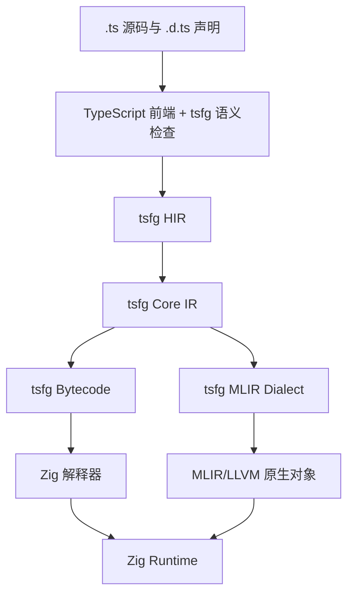

# tsfg（TypeScript for Game）整体架构方案

## 远景与目标

tsfg 是面向游戏引擎的静态语言、编译器和运行时。源码采用 TypeScript 语法与类型工具，宿主采用 Zig；同一份源码同时生成解释器字节码和原生机器码。tsfg 不是 JavaScript 实现，也不承诺 ECMAScript 运行时兼容。

tsfg 的核心目标：

- TypeScript 与 Zig 共享固定内存布局；AOT 调用零封送、零复制。
- 函数级热更新按“旧原生代码 → 字节码解释执行 → 新原生代码”切换。
- 解释器和 AOT 共用类型、控制流、异常和内存语义。
- 数据导向容器、查询、并行调度和向量化属于语言与编译器，不形成 Unity 式的多套 API。
- `eval_bytecode` 只执行已经验证的 tsfg 字节码，不在运行时编译源码。
- 编译器可复用 TypeScript、Mojo、MLIR、LLVM 及相关开源实现中的代码；R00 只规定载体为同级 upstream fork、Integration Manifest 完整 commit OID、逐文件审计与 fork 特性分支，不批准任何具体来源或迁入内容，也不依赖对方产品运行时。

## 明确边界

tsfg 不支持以下内容：

- `.js`、`.mjs`、`.cjs`、JS 字节码和 JS 包。
- `any`、`eval`、`Function(string)`、原型链修改、`Proxy`、动态属性增删。
- JS 数组、JS 对象字典、隐式装箱、隐式数值类型变化、宽松相等。
- 将 GC 对象裸指针交给 Zig。
- 运行时携带 TypeScript 前端、MLIR 或 LLVM。
- 正在执行的栈帧迁移；旧栈帧执行结束，新调用进入新函数版本。
- 把 MLIR 字节码当作游戏运行时字节码。

## 总体结构



编译产物分为三类：

| 产物 | 内容 | 消费者 |
|---|---|---|
| `.tbc` | 类型化字节码、常量、栈图、异常表、调试映射 | Zig 解释器 |
| `.tmeta` | ABI、反射、组件、查询、读写集合、热更签名 | Zig Runtime 与工具链 |
| 原生对象 | 平台机器码、重定位、调试信息 | Zig 宿主与代码加载器 |

发布运行时只包含 Zig Runtime、解释器、字节码验证器、GC、函数注册表、任务调度器和 ABI 桥。编译器进程包含 TypeScript 前端、tsfg IR、MLIR、LLVM 与原生链接服务。

## 语言模型

### TypeScript 前端

前端迁入微软 TypeScript 的 scanner、parser、AST、类型检查、控制流收窄、模块解析、诊断和 Language Service 代码。tsfg 在其后执行更严格的语义检查，并直接生成 tsfg HIR；流程中不存在 JavaScript 输出。

输入规则固定为：

- 只接收 `.ts`、`.d.ts` 和预编译 tsfg 包。
- 第三方包必须提供符合 tsfg 子集的 TypeScript 源码或 tsfg 编译产物。
- `.d.ts` 只描述编译期类型和原生接口，不代表 JS 实现。
- `interface`、条件类型、映射类型和泛型只参与编译期分析，不产生运行时对象。

### 类型与语义

| 类别 | tsfg 语义 |
|---|---|
| `i8…i64`、`u8…u64`、`isize`、`usize` | 定宽整数；算术按位宽回绕，除零和非法移位触发 trap |
| `f16`、`f32`、`f64` | IEEE 浮点；`number` 固定等价于 `f64` |
| `bool` | ABI 中固定为 `u8`，仅接受 `0` 和 `1` |
| `T[]` / `Array<T>` | 连续、同构、带长度与容量的向量，不采用 JS 稀疏数组语义 |
| `ReadSpan<T>` / `Span<T>` | 借用视图；函数返回和闭包捕获受逃逸检查约束 |
| `string` | 不变 UTF-8 字符串；ABI 使用 `StringView { ptr, len }` |
| `@value class` | 固定布局值类型 |
| `@component class` | 固定布局 ECS 组件 |
| 普通 `class` | 密封引用类型，由 tsfg GC 管理 |
| 联合类型 | 编译期联合或显式带标签联合；不生成隐式动态值 |
| 泛型 | 全程序特化；原生 ABI 不暴露未特化泛型 |

严格空值检查始终开启。字段集合在类型定义结束后固定。异常只存在于受管逻辑层，不穿越 Zig ABI，也不进入计算内核。异步函数不进入计算内核。

## 内存模型与 Zig ABI

tsfg 将内存分为两个平面：

1. **值平面**：值类型、组件、Span 和原生容器。数据位于 Zig 分配器、ECS chunk 或显式 arena 中，无 GC、无装箱。
2. **引用平面**：普通类、闭包环境和字符串。运行时采用增量分代追踪 GC；年轻代移动，老年代不移动。AOT 使用 LLVM statepoint/stack map，解释器使用寄存器根表。

Zig 与 tsfg 之间只暴露 ABI 安全类型：定宽标量、`extern struct`、显式标签联合、Span、StringView、资源句柄和固定签名函数指针。引用对象通过 `Handle<T> { index: u32, generation: u32 }` 传递；Zig 不持有受管裸指针。

### ABI 单一事实源

tsfg 源码中的 `@abi` 声明生成规范化 `.tsfgabi`；既有 Zig API 由 Zig comptime 导出同一格式。绑定生成器分别生成 tsfg 声明和 Zig `extern` 类型，并在两端生成：

- `size`、`align`、字段 offset 断言；
- 调用约定、整数符号、枚举底层类型断言；
- ABI 哈希与目标三元组校验。

原生边界采用目标平台 C ABI。非热更函数生成直接调用；热更函数经过稳定函数槽，多一次间接分支。这里的“零损耗”严格指 AOT 边界无序列化、无布局转换、无复制；解释器调用原生函数仍包含 VM 到 Native 的必要切换。

## 统一 IR 与后端

### tsfg HIR

HIR 保留 TypeScript 源位置、泛型、空值收窄、闭包、异常和高层容器语义，负责产出清晰诊断。

### tsfg Core IR

Core IR 是类型化 SSA 表示，完成泛型特化、闭包显式化、值/引用分类、逃逸分析、借用检查、效果分析和异常边转换。字节码与原生后端都从 Core IR 降低，禁止两套语义实现。

### MLIR/LLVM 路径

tsfg 定义小型 `tsfg` dialect，保留下列领域操作：

- `tsfg.handle`、`tsfg.safepoint`：受管引用与 GC；
- `tsfg.call_hot`：热更函数调用；
- `tsfg.borrow`：Span 与借用范围；
- `tsfg.query`、`tsfg.chunk`、`tsfg.parallel_for`：数据导向查询和并行执行。

普通计算降低到 MLIR 官方 `func`、`arith`、`math`、`cf`、`scf`、`memref`、`affine`、`vector`、`gpu` 和 `LLVM` dialect。数据布局由 MLIR DataLayout 与 LLVM target DataLayout 驱动。CPU 路径输出 LLVM IR 和位置无关对象；编译服务通过 LLD 生成平台补丁库。显式 GPU kernel 经 GPU dialect 输出对应设备后端。Zig Runtime 通过平台加载器装入补丁库，不链接 LLVM。

生成 Zig 源码不作为主后端。Zig 只承载 Runtime、调度器、绑定和平台集成，避免把 Zig 前端加入热更编译链。

## 字节码与解释器

tsfg Bytecode 是稳定、类型化、寄存器式指令集，包含函数签名、寄存器类型、控制流边界、异常表、GC 根图和源映射。验证器在加载前检查类型、跳转、调用签名、资源上限和 ABI 哈希。

Zig 解释器采用：

- 预解码指令与紧凑寄存器帧；
- 按标量类型区分的算术、比较、加载和存储指令；
- 字段访问、密封类调用和原生调用缓存；
- 常见指令序列的 superinstruction；
- 函数级采样计数，不在运行时执行 LLVM 编译。

`eval_bytecode` 接受已经验证的模块、`FunctionId`、类型化参数帧和能力表。它不接受源码，不解析 TypeScript，不访问未授权宿主函数。指令数、内存、递归深度和宿主能力均由调用方限定。

## 函数级热更新

每个热更函数拥有稳定 `FunctionId` 和 `FunctionCell`：

```text
FunctionCell = {
  entry,
  tier: bytecode | native,
  code_version,
  signature_hash,
  effect_hash
}
```

切换协议固定为：

1. 编译器生成新字节码，并验证函数签名、闭包捕获布局和效果集合。
2. Runtime 原子地把 `FunctionCell.entry` 指向字节码入口。
3. 旧原生栈帧继续执行；新调用进入解释器。
4. 编译服务从同一 Core IR 生成并链接新原生补丁库。
5. Runtime 装入补丁库，解析入口并原子地更新函数槽。
6. epoch 回收器在旧代码无活动栈帧后卸载旧补丁库。

闭包保存 `FunctionId`，不保存代码地址。静态状态保存于独立、带 schema hash 的状态块。函数签名、捕获布局或状态 schema 变化时，函数级补丁直接拒绝；数据迁移属于模块重载，不伪装成函数热更。

## 高性能游戏计算框架

计算框架直接使用 TypeScript 语法、类型系统和编译器效果分析：

```ts
@component
export class Position {
  x: f32 = 0;
  y: f32 = 0;
}

@component
export class Velocity {
  x: f32 = 0;
  y: f32 = 0;
}

@system
export function integrate(
  q: Query<[Write<Position>, Read<Velocity>]>,
  dt: f32,
): void {
  for (const [p, v] of q) {
    p.x += v.x * dt;
    p.y += v.y * dt;
  }
}
```

其执行模型如下：

- `@component` 生成固定布局、反射、序列化和 Zig ABI 元数据。
- 世界存储采用 archetype chunk；每种组件在 chunk 中占一个连续列。
- `Read<T>` 与 `Write<T>` 形成静态访问集合；编译器据此生成冲突图和调度描述。
- 系统按 chunk 自动拆分；Zig JobSystem 对无冲突 chunk 并行执行。
- Query 直接产生借用视图，不创建对象、不复制组件、不执行虚调用。
- 内核禁止受管分配、GC 引用、异常、`await`、锁和逃逸借用。
- Core IR 将查询循环变为 `tsfg.parallel_for`；MLIR 完成循环融合、别名分析、边界消除、向量化和目标指令选择。
- 调试构建启用越界、生命周期、并发读写和句柄代数检查；发布构建移除已经静态证明的检查。

因此，用户只编写组件、查询和普通函数；不存在 `NativeArray`、Job struct、手工 `Schedule/Complete` 和独立 Burst 标记。解释执行保持相同 API；原生后端将满足内核约束的代码编译为无 GC、无装箱的机器码。

## 开源基础设施复用规则

tsfg 不嵌入其他语言运行时，也不把外部编译器当作黑盒子调用。经 R02a 批准的来源保留在与产品仓同级的 upstream fork 中，由 Integration Manifest 锁定完整 commit OID，tsfg 专用修改直接提交到 fork 特性分支；逐文件记录来源、base OID、许可证、本地修改和对应测试。产品构建可以消费这些锁定源码，但产品仓不保存 fork 副本。

| 来源 | 候选复用范围 | 明确排除 |
|---|---|---|
| TypeScript | scanner、parser、AST、类型检查、控制流收窄、模块解析、Language Service、source map | JS emitter、JS 运行时假设、`allowJs` 路径 |
| scriptc | TS 到类型化 IR 的降低结构、静态子集诊断、IR 序列化与差分测试方法 | QuickJS 动态岛、Node API、JS 兼容层、仅 `f64` 的数值模型、其运行时内存模型 |
| Mojo | ownership/borrow 分析、值类型 passability、泛型特化、SIMD 抽象、MLIR dialect 组织、CPU/GPU lowering 与诊断实现 | Mojo 语法前端、Python 兼容层、MAX 及其运行时 |
| MLIR | ODS、类型与操作接口、PassManager、PatternRewriter、Dialect Conversion、DataLayout、官方 dialect 与 LLVM IR 转换 | MLIR 字节码运行时 |
| LLVM | 优化器、目标代码生成、对象文件、调试信息、ORC/JITLink、statepoint、stack map | 将 LLVM 装入发布运行时 |
| Hermes / QuickJS | 字节码验证、GC 根图、解释器测试与模糊测试方法 | ECMAScript 语义、对象模型、JSI、JS 标准库 |
| WAMR / Porffor | 预解码、tier 切换、代码缓存、AOT 差分测试实现 | Wasm 作为 tsfg 语义层、JS 前端与 JS 运行时 |

Mojo、LLVM/MLIR 及 TypeScript 的迁入代码保留各自许可证和 NOTICE；其他来源按文件许可证执行。许可证不清晰的文件不进入 tsfg。

## 工具与模块边界

| 模块 | 职责 |
|---|---|
| `tsfgc` | TypeScript 前端、语义检查、HIR/Core IR、字节码与原生编译 |
| `tsfg-vm` | Zig 寄存器解释器、验证器、调试器接口 |
| `tsfg-runtime` | GC、FunctionCell、模块加载、句柄、异常和宿主服务 |
| `tsfg-jobs` | chunk、查询、访问冲突图、工作窃取调度器 |
| `tsfg-abi` | `.tsfgabi`、Zig/TypeScript 绑定和布局断言 |
| `tsfg-compiler-service` | 热更编译、对象链接、补丁打包和代码回收协调 |
| `tsfg-lsp` | TypeScript 语言服务与 tsfg 语义诊断合并 |

## 必须保持的工程不变量

- 同一 Core IR 函数在解释器与 AOT 下通过差分测试得到相同结果。
- ABI 布局由目标 DataLayout 计算，不由手写常量推断。
- 热更函数只通过 `FunctionCell` 发布入口；代码地址不进入持久数据。
- 计算内核的读写集合完整进入 `.tmeta`，调度器不猜测访问关系。
- 所有字节码在执行前完成验证；`eval_bytecode` 不绕过验证器。
- 任何 JS 语义回退均为编译错误，不加载备用 JS 引擎。
- 发布运行时不依赖 TypeScript、Mojo、MLIR、LLVM、scriptc 或 JS VM。

## 结论

tsfg 的正确形态不是“嵌入一个 TypeScript VM”，而是“自建 TypeScript 语法的静态游戏语言”：TypeScript 负责源码与编辑器体验，tsfg Core IR 统一解释器和原生语义，MLIR/LLVM 负责优化与机器码，Zig 负责宿主、运行时和任务系统。固定布局值平面解决 Zig 互操作，受管引用平面隔离 GC，FunctionCell 解决函数热更新，编译器内建 Query/Job 语义解决高性能游戏计算。

## 参考基础设施

- [TypeScript Compiler API](https://github.com/microsoft/TypeScript/wiki/Using-the-Compiler-API)
- [scriptc：编译流程](https://scriptc.dev/how-it-works)；[限制](https://scriptc.dev/limitations)；[FFI](https://scriptc.dev/ffi)
- [Mojo 开源仓库与许可证](https://github.com/modular/modular)
- [MLIR Dialect Conversion](https://mlir.llvm.org/docs/DialectConversion/)；[Data Layout](https://mlir.llvm.org/docs/DataLayout/)；[LLVM IR Target](https://mlir.llvm.org/docs/TargetLLVMIR/)
- [LLVM](https://llvm.org/docs/)；[LLD](https://lld.llvm.org/)；[GC Statepoints](https://llvm.org/docs/Statepoints.html)
- [Zig 语言文档](https://ziglang.org/documentation/master/)
