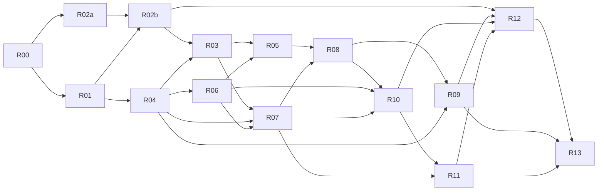

<!-- SPDX-License-Identifier: MIT -->

# tsfg 完整方案交付 Roadmap

## 1. 文档目的

本文把 [`tsfg-architecture.md`](./tsfg-architecture.md) 描述的完整方案拆成可逐一经历 **grill with docs → to spec → to tickets → implement** 的大任务。

这里的阶段是验证门，不是产品裁剪：

- 不以“先做一个可丢弃的解释器 / MVP / 临时 IR”作为终点。
- 每个阶段产出的 interface、格式、测试和实现都必须能继续演进为最终系统的一部分。
- 中间演示只证明风险已经被消除，不能替代该任务的完成条件。
- 整体完成的唯一标准是第 4 节所有大任务完成，并通过第 6 节的系统级验收。

## 2. 拆分原则

1. **按稳定 seam 拆分，而不是按目录拆分。** 每个大任务应产生少量、明确、可版本化的 interface，并隐藏足够多的实现复杂度。
2. **契约先于消费者。** 语言语义、Core IR、`.tbc`、`.tmeta`、`.tsfgabi` 和热更协议必须有规范、版本与测试向量，编译器和运行时才能跨 Git 并行。
3. **同一语义只实现一次。** HIR 到 Core IR 完成语义归一化；字节码和 AOT 后端不得各自补做一套语言语义。
4. **测试穿过正式 interface。** 测试与真实调用方使用相同的序列化格式、加载路径和执行入口，不建立只供测试绕行的特殊入口。
5. **兼容性变更采用扩展—迁移—移除。** 跨仓格式先增加兼容字段与读路径，所有生产者/消费者迁移后才移除旧版本。
6. **风险前置但不缩减终局。** GC statepoint、ABI、双后端等价、热更回收、借用/效果分析和 GPU 是高风险验证点；验证成功后继续产品化，不停留在样例实现。

后续 spec 应围绕下列关键 seam 收敛；interface 名称是当前工作名，可在 grill 后调整，但职责不得重新渗透：

| Module | 建议的主要 interface | interface 之外隐藏的 implementation |
|---|---|---|
| Frontend | `analyzeProject(config, changes) -> FrontendSnapshot` | TypeScript AST/Checker、模块缓存和上游版本细节 |
| Core pipeline | `lowerAndVerify(snapshot, target) -> VerifiedCoreModule` | HIR、pass 顺序、特化、闭包、借用、效果和异常转换 |
| Bytecode producer | `emitBytecode(core) -> TbcArtifact` | 寄存器分配、编码与 superinstruction 选择 |
| Native producer | `emitNative(core, target) -> NativeArtifact` | MLIR/LLVM pass、对象生成与链接细节 |
| Bytecode trust gate | `verify(bytes, host, limits) -> VerifiedModule` | 安全解析、CFG/type/root/ABI 检查 |
| Runtime execution | `invoke(verified, function, frame, capabilities, limits) -> Outcome` | VM dispatch、调用缓存、GC 和异常展开 |
| Patch install | `preparePatch(package) -> PreparedPatch`；`commit(prepared) -> InstalledVersion` | 动态加载、stack map、epoch 和回滚实现 |
| Language intelligence | `query(snapshot, request) -> response` | TypeScript Language Service 与 tsfg 诊断合并 |

## 3. 完整交付的定义

只有同时满足以下条件，tsfg 整体方案才算完成：

- `.ts` / `.d.ts` 经 tsfg 前端和静态语义检查生成 HIR、唯一的 Core IR、`.tbc`、`.tmeta` 与目标平台原生对象；流程中没有 JavaScript 输出或运行时回退。
- 同一 Core IR 在解释器与同目标 AOT 严格模式下满足 Execution Equivalence；fast-math、并行归约和 GPU 使用各自明确的等价契约。
- Zig 与 tsfg 的 ABI 由同一事实源生成并验证；AOT 边界无序列化、无布局转换、无复制，受管对象只以带代数的句柄跨越 ABI。
- 发布运行时包含验证器、解释器、GC、模块加载、FunctionCell、调度器、ABI 桥和代码回收，但不包含 TypeScript、Mojo、MLIR、LLVM、scriptc 或 JS VM。
- 函数热更新完整实现“旧 native → bytecode → 新 native”，包含签名/效果/捕获/状态校验、并发切换、旧栈帧完成和 epoch 安全卸载。
- `@component`、Query、访问集合、chunk、冲突图、自动并行、CPU 向量化和显式 GPU kernel 走统一语言与 Core IR 路径，不形成第二套用户编程模型。
- LSP、诊断、调试映射、包消费、构建、缓存、可复现构建、平台发布和兼容性策略可供真实项目使用。
- 支持多个 Git 仓库同时开发：契约可版本化发布，集成清单可精确复现，多仓 CI 能验证兼容组合。
- 所有迁入上游代码都有来源提交、许可证、NOTICE、本地修改和对应测试记录。

## 4. 大任务清单

### R00：工程章程、仓库拓扑与可复现构建

**目标**：建立所有后续工作共享的工程规则和多 Git 集成骨架。

**澄清规范**：[`r00-engineering-charter.md`](./r00-engineering-charter.md)。该规范记录已批准目标；仓库、源码、CI、缓存与制品在通过阶段验收前均不得视为已存在。

**主要产出**：

- 目标平台 / 三元组 / 构建类型 / 支持矩阵与版本策略。
- 跨仓版本规则、兼容窗口、变更提案模板、所有权和发布流程。
- 工具链锁定文件、依赖来源清单、Hermetic build 入口和制品命名规则。
- 独立 Manifest Repository：以完整 commit OID 锁定 `tsfg`、`.agents` 与以后经批准的同级 upstream fork；仓内 contracts/compiler/runtime/tooling 的版本事实由 Product Version、Contract Registry 与 Contract Set 记录。
- 基础 CI：格式、静态检查、许可证检查、单仓测试、多仓组合测试入口。

**阶段验收**：在全新环境按 manifest 拉取多个仓库，离线使用已缓存依赖完成空骨架构建；同一提交组合生成相同 schema/hash；破坏兼容性的契约改动会被 CI 拒绝。

**依赖**：无。它是其余任务的共同前置。

### R01：规范化语言语义与一致性测试语料

**目标**：把架构描述提升为可执行、可判定的语言契约。

**主要产出**：

- 词法、语法、名称解析、类型、泛型特化、数值、空值、类/值类型、闭包、异常、模块和初始化顺序规范。
- JS/TS 特性的支持矩阵与必须诊断的拒绝矩阵。
- trap、溢出、浮点、求值顺序、资源限制和确定性语义。
- fast-math、并行归约与 GPU 的独立数值/确定性契约，包括 NaN、容差、迭代顺序和允许的非确定性；不得借用严格 Execution Equivalence 的结论。
- 内核子语言规范：禁止项、借用、效果、并行与 GPU 限制。
- 正例、负例和语义 oracle 组成的 conformance corpus；每个规则有稳定诊断码。

**阶段验收**：规范中的每个 MUST / MUST NOT 都能映射到测试；争议语义没有“按后端实现决定”；语料可被前端、Core IR、VM、AOT、LSP 共用。

**依赖**：R00。

### R02a：上游源码治理与可复现集成

**目标**：把外部源码从“参考链接”变成可重放、可审计、可升级的工程输入。

**主要产出**：

- TypeScript、MLIR/LLVM 及其他实际批准来源的同级 fork、固定 commit、逐文件 intake ledger、SPDX/NOTICE 与本地修改记录。
- fork 特性分支与完整 OID manifest、SBOM、允许/禁止消费清单和漏洞响应流程；不以产品仓内 vendor 副本、snapshot/import 脚本或脱离 Git 历史的 patch queue 作为事实源。
- “构建消费的 fork 源码”与“仅借鉴算法/测试方法”的明确分类；不为只借鉴的方法建立虚假仓库 seam。
- 上游升级分支流程，以及语义、诊断、性能、许可证差异报告模板。

**阶段验收**：全新环境能从锁定输入重建；provenance 与许可证覆盖率为 100%；未知许可证阻断合入；上游升级不依赖维护者机器上的隐式状态。

**依赖**：R00。可与 R01 并行，不依赖语言实现。

### R02b：TypeScript 前端产品化

**目标**：形成只服务 tsfg 的 scanner、parser、AST、类型分析、模块解析和 Language Service 基础，不携带 JS 输出路径。

**主要产出**：

- tsfg Program 输入管线、模块图、诊断合并与增量前端 interface。
- tsfg 额外标量、装饰器、值类型、Span、Handle、Query 等声明和解析/类型接入。
- 对 `.js`、动态对象语义、`any`、运行时泛型等禁止项的结构化诊断。
- 隐藏 TypeScript Program、AST、Checker 和缓存细节的 `FrontendSnapshot` interface；下游不暴露上游类型。

**阶段验收**：R01 全部前端正负例通过；输入图中不能进入 JS 文件；禁用 emitter 后仍能完成 tsfg 编译前端；冷编译与增量编译产生相同 snapshot、诊断和源码位置；TypeScript 内部对象不跨越前端 seam。

**依赖**：R01、R02a。可与 R04 的格式设计并行。

### R03：HIR、Core IR 与语义归一化

**目标**：建立字节码和 AOT 唯一共享的语义中枢。

**主要产出**：

- 保留源位置、高层类型、收窄、泛型、闭包和异常的 HIR。
- 类型化 SSA Core IR；显式 CFG、值/引用分类、闭包环境、异常边和调用效果。
- 泛型全程序特化、逃逸/借用检查、效果推导和内核合法性分析。
- IR verifier、规范化打印格式、版本化序列化和 pass 管理规则。
- 前端→HIR→Core IR 的 golden、负例、round-trip 与变形测试。

**阶段验收**：R01 的所有可执行语义均在进入后端前完成归一化；非法 IR 必被 verifier 拒绝；后端不需要访问 TypeScript AST；同一程序在增量与全量编译下产生规范等价 Core IR。

**依赖**：R01、R02b，以及 R04 中 Core IR 的 schema 约定。

### R04：跨仓制品格式、元数据与 ABI 单一事实源

**目标**：冻结 compiler/runtime/tooling 之间最关键的 seam，使多 Git 并行成为现实。

**主要产出**：

- `.tbc`、`.tmeta`、`.tsfgabi`、Core IR exchange form 的规范、版本、校验和前后兼容规则。
- FunctionId、TypeId、资源句柄、签名/效果/schema hash 的规范化算法。
- 原生补丁包、模块重载事务和 compiler-service 请求/响应的版本化协议。
- DataLayout 驱动的 size、align、offset、调用约定、符号性和枚举底层类型模型。
- tsfg 声明与 Zig `extern` 类型/绑定生成器；两端静态断言与运行时握手。
- 独立 contract test kit、二进制 fixtures、fuzzer seed corpus 与旧版本 fixtures。

**阶段验收**：至少两个独立实现读取同一 fixtures 得到一致结果；多目标 ABI 与 Zig/C 探针逐字段一致；未知/损坏/不兼容版本 fail closed；不依赖手写布局常量。

**依赖**：R00、R01。与 R02b 并行，随后约束 R03、R05、R06、R07、R09、R10。

### R05：类型化字节码、验证器与 Zig 解释器

**目标**：完成稳定、受限、可调试的解释执行路径。

**主要产出**：

- Core IR→寄存器字节码 lowering、常量池、函数签名、异常表、根图和源映射。
- 加载前验证器：类型、CFG、调用、异常区域、资源限额、ABI hash 和能力检查。
- Zig 预解码解释器、紧凑帧、标量专用指令、字段/调用缓存与 superinstruction。
- 唯一公开执行 interface：verified module + FunctionId + 类型化参数帧 + capability table。
- 指令级、函数级、模块级测试，恶意输入 fuzz 和资源配额测试。

**阶段验收**：未经验证的模块无法抵达执行入口；R01 适用语料全部通过；损坏字节码不会越界或获取未授权宿主能力；异常、trap 与 GC 根图在压力测试下正确。

**依赖**：R03、R04、R06 的最小运行时 interface。验证器和解释器实现可并行。

### R06：Zig Runtime、GC、句柄与宿主能力

**目标**：完成解释器和 AOT 共同依赖的内存与宿主运行时。

**主要产出**：

- 值平面的 allocator/arena/Span/StringView，以及引用平面的对象模型。
- 增量分代追踪 GC：移动年轻代、不移动老年代、写屏障、解释器根表、AOT stack map/statepoint 接入。
- `Handle<T>` 代数校验、资源表、能力表、受管异常与 ABI 异常隔离。
- 模块加载/卸载、静态状态块、生命周期、并发与故障模型。
- 泄漏、悬垂句柄、移动对象、并发 safepoint、OOM 和长帧暂停测试。

**阶段验收**：Zig 永不持有受管裸指针；移动/回收/代数复用后旧句柄确定失败；解释器和 AOT 根都能保活且不泄漏；异常不穿越 Zig ABI；发布 runtime 依赖审计通过。

**依赖**：R01、R04。可与 R02b、R03 主体并行，随后与 R05/R07 联调。

### R07：tsfg MLIR Dialect、优化流水线与 AOT 后端

**目标**：从同一 Core IR 生成可装载的 CPU/GPU 原生制品，不把编译器带入发布运行时。

**主要产出**：

- `tsfg` dialect 的类型、操作、verifier 和 canonicalization。
- Core IR→tsfg/官方 dialect→LLVM IR lowering；DataLayout、PIC、对象、重定位和调试信息。
- GC statepoint/stack map、热更调用槽、借用和查询操作的 lowering。
- LLD 补丁库链接、目标平台加载所需的对象/导出约定。
- 优化 pass 契约、严格浮点模式、可审计的 pass pipeline 与 miscompile 回归语料。

**阶段验收**：支持矩阵内每个 CPU 目标都能从 Core IR 产生并加载对象；布局与 R04 一致；AOT GC 压力测试通过；编译器依赖不进入发布 runtime；所有 lowering 后 dialect verifier 通过。

**依赖**：R03、R04、R06。CPU 主路径先完成验收；GPU 专项由 R11 收口。

### R08：双后端执行等价与差分验证平台

**目标**：把“解释器与 AOT 共用语义”变成持续、系统性的证据。

**主要产出**：

- Core IR 级程序生成器、reducer、record/replay 和跨后端 runner。
- 整数、浮点严格模式、trap、控制流、异常、内存和 ABI 的结果比较器。
- 优化级别、目标平台、调试/发布、GC 压力和随机调度测试矩阵。
- fast-math、并行归约、GPU 的单独等价关系和容差/非确定性契约。
- 每个失败样例自动最小化并沉淀为永久回归测试。

**阶段验收**：R01 conformance corpus 在 VM/AOT 全矩阵一致；规模化生成测试达到规定预算且零未归类差异；任何新 Core IR op 未提供双后端测试即不能合入。

**依赖**：R05、R07；其测试框架可在二者开发期间提前搭建。

### R09：FunctionCell 热更新与编译服务

**目标**：完整实现函数级“旧 native → bytecode → 新 native”切换和安全回收。

**主要产出**：

- 稳定 FunctionId/FunctionCell、闭包间接调用、原子发布与版本可见性协议。
- 签名、效果、闭包捕获布局和静态状态 schema 的兼容检查与拒绝诊断。
- 增量编译、对象链接、补丁打包、平台加载和失败回滚。
- 活动帧跟踪、epoch 回收、旧补丁库卸载和进程退出清理。
- schema 变化时显式模块重载/迁移事务；函数级补丁不得暗中执行数据迁移。
- 并发调用、递归、异常、补丁失败、服务崩溃、重复更新和高频更新测试。

**阶段验收**：压力场景中旧帧完成、新调用按协议切换；编译进程崩溃、超时、乱序响应或损坏补丁均保持上一个可用版本；无活跃代码被卸载；不兼容变更稳定拒绝并指向可测试、可回滚的模块重载事务；runtime 无 LLVM/MLIR/LLD 依赖。

**依赖**：R04、R05、R06、R07、R08。

### R10：ECS 存储、Query、效果图与 CPU Jobs

**目标**：让数据导向计算成为语言和编译器的一等能力，并完成 CPU 高性能执行路径。

**主要产出**：

- `@component` 固定布局、反射、序列化和 `.tmeta` 生成。
- archetype/chunk/连续列存储，结构变更、实体/组件生命周期和句柄规则。
- `Read<T>`/`Write<T>`/Query 借用 interface、静态读写集合和冲突图。
- `tsfg.query`、`tsfg.chunk`、`tsfg.parallel_for` lowering，循环融合、别名/边界分析和向量化。
- Zig work-stealing JobSystem、确定性/非确定性模式、取消、错误与调试检查。
- 解释执行与 AOT 使用同一用户模型和 `.tmeta`，无手工 Job/Burst 旁路。

**阶段验收**：调度器只消费完整访问集合且不猜测；数据竞争检查能抓住注入缺陷；查询不分配对象、不复制组件、不虚调用；串行/并行语义按规范一致；代表性内核达到事先批准的性能门槛。

**依赖**：R03、R04、R05、R06、R07、R08。存储/调度器可与编译器效果分析并行，靠 contract fixtures 联调。

### R11：显式 GPU Kernel 与设备后端

**目标**：在同一 tsfg 内核模型上完成选定 GPU 平台的编译、加载、执行与验证。

**主要产出**：

- GPU 可用类型、地址空间、资源、同步、错误和确定性规范。
- Core IR 内核合法性、host/device seam、GPU dialect lowering 与选定设备后端。
- buffer/资源生命周期、上传下载、pipeline/cache、调度和诊断。
- GPU kernel 与热更的版本规则、在途 kernel/fence 处理和旧设备代码回收。
- CPU reference、设备结果比较、shader/kernel 验证和多设备 CI。
- 不支持能力的静态拒绝与运行时 feature negotiation。

**阶段验收**：支持矩阵内真实设备通过 conformance/performance/错误恢复和长稳测试；所有 host-device 复制均显式可见；CPU 与 GPU 按 R08 定义的关系一致；在途 kernel 遇到热更、device loss、OOM 和缓存损坏时按规范完成或回滚；无受管引用、异常或逃逸借用进入 kernel。

**依赖**：R03、R04、R07、R08、R10。需要先完成人工 GPU 后端范围决策，见第 8 节。

### R12：开发者工具、包系统、LSP 与调试体验

**目标**：完成真实项目所需的编译、编辑、诊断、调试、包消费和可观测性闭环。

**主要产出**：

- `tsfgc` CLI/build interface、项目清单、模块解析、增量缓存和预编译包格式。
- `tsfg-lsp`：TypeScript Language Service 与 tsfg 语义、内核、ABI、热更诊断合并。
- `.tbc`/`.tmeta`/Core IR 查看器，源映射，解释器/AOT 统一断点、栈帧和变量模型。
- 热更状态、函数版本、GC、Jobs 和设备执行的 tracing/profiling interface。
- Zig 绑定生成和宿主集成样例；兼容升级、包发布与离线构建流程。

**阶段验收**：一个非平凡示例项目只通过公开工具从编辑、构建、运行、调试、热更到打包；增量结果与 clean build 一致；诊断可定位到源码；预编译包无需原始源码即可消费且兼容性检查有效。

**依赖**：R02b-R11 的稳定 interface。LSP/查看器/CLI 可提前并行，最终验收在上游能力齐备后进行。

### R13：系统加固、平台认证与完整发布

**目标**：将所有模块收口为可支持、可升级、可复现的完整产品。

**主要产出**：

- 全平台/架构/配置测试矩阵，长稳、并发、OOM、fuzz、安全、性能和确定性基线。
- 制品签名、SBOM、NOTICE、漏洞响应、崩溃符号、遥测边界和发布/回滚手册。
- 跨版本 `.tbc`/`.tmeta`/`.tsfgabi`/包/热更兼容矩阵和迁移工具。
- 发布 runtime 依赖封闭性审计、可复现构建证明和第三方许可证总审计。
- 完整文档：语言、宿主、ABI、性能、调试、部署、升级与故障排查。
- 分层 CI：PR 快速确定性测试，merge 全平台组合，nightly fuzz/stress/performance/GPU，release 全支持矩阵与长稳认证。

**阶段验收**：第 3 节所有条件都有自动化证据或签署记录；支持矩阵全绿；从上一受支持版本升级及回滚演练通过；发布包内容审计确认没有被明确排除的运行时依赖。

**依赖**：全部此前任务（R00 至 R12，含 R02a/R02b）。加固基础设施应持续建设，最终在此统一关闭。

## 5. 依赖与并行路线

建议的并行泳道：

| 泳道 | 主任务 | 可并行方式 |
|---|---|---|
| Contracts | R00 → R01 → R04 | 语言语义、二进制 schema、ABI 探针分 worktree；最终统一版本评审 |
| Compiler | R02a → R02b → R03 → R07 | 上游迁入、前端、IR verifier、各 lowering pass 按稳定 fixtures 并行 |
| Runtime | R06 → R05 → R09 | GC/句柄、验证器/解释器、加载/回收并行，依靠 contract test kit 对齐 |
| Game compute | R10 → R11 | ECS 存储/调度器、效果分析/lowering、设备后端分仓并行 |
| Quality/tooling | R08、R12、R13 | 从首个格式版本开始持续接入，不等功能实现结束才补测试和工具 |

关键路径大致为 `R00 → R01/R02a → R04/R02b → R03 → R06/R05/R07 → R08 → R09/R10 → R11/R12 → R13`。R09 与 R10 在 R08 后可并行；R12 的子项应持续前置，但完整关闭依赖所有执行能力。

## 6. 系统级验证门

各大任务的局部验收之外，必须依次通过以下集成门：

| 验证门 | 验证内容 | 通过后仍需继续的工作 |
|---|---|---|
| G1 契约闭环 | 独立 producer/consumer 读写全部格式，ABI 探针一致 | 不代表编译器或 runtime 已完成 |
| G2 语义闭环 | 源码→Core IR→verified bytecode→Zig VM 通过 conformance | 继续完成 AOT、GC 全路径和工具化 |
| G3 双后端闭环 | 同一 Core IR 的 VM/AOT 严格等价，多目标通过 | 继续完成热更、ECS/Jobs、GPU |
| G4 热更闭环 | native→bytecode→native 并发切换与 epoch 回收通过 | 继续完成数据导向计算和产品体验 |
| G5 游戏计算闭环 | Query/Jobs/向量化/GPU 使用统一模型并达到正确性与性能门槛 | 继续完成平台加固与发布认证 |
| G6 产品闭环 | 工具链、包、调试、升级、发布、安全和许可证全部通过 | 整体方案完成 |

每个验证门至少保留：输入版本、目标三元组、构建配置、随机种子、日志、性能基线、生成制品 hash 和失败重放方式。

## 7. 每个大任务后续细化流程

后续逐项推进时统一使用下面四个关口，避免从宽泛架构直接跳到实现：

### 7.1 Grill with docs

- 明确用户场景、非目标、术语、威胁模型、失败模式和性能预算。
- 对每个 module 写出 interface：输入输出、状态、不变量、顺序、错误、并发、资源和兼容性。
- 列出至少两个可行设计，比较 seam、深度、可测试性与跨仓耦合。
- 记录未决问题和需要人工拍板的决定；未关闭的高风险决定不能进入 spec。

### 7.2 To spec

- 将决定改写为规范性 MUST / SHOULD / MUST NOT。
- 定义 schema、状态机、算法、版本协商、错误码、资源上限和安全约束。
- 同时提交 fixtures、golden、负例和兼容测试计划；规范条款必须可追到测试 ID。
- 对跨仓 interface 指定 owner、消费者、兼容窗口和废弃流程。

### 7.3 To tickets

- ticket 按可合入的纵向能力拆分，不按“先写全部类型、再写全部实现”横切。
- 每张 ticket 标注仓库、worktree、依赖的 spec/测试 ID、改动的 interface、验收命令和完成证据。
- 任何需要两个仓同时原子变化的工作，先拆成兼容扩展、消费者迁移、旧路径移除三组 ticket。
- 性能 ticket 必须同时指定正确性 oracle、基线场景、硬件/构建条件和回归阈值。

### 7.4 Implement

- 实现只能消费已批准的 spec 版本；偏离 spec 先回写变更提案。
- 生产实现、公开 interface 测试、兼容 fixtures、文档和可观测性一并合入。
- 合入前运行单仓 CI 和 manifest 指定的多仓组合 CI；不能用临时 shim 宣布完成。
- 大任务关闭时提交验收报告，逐项链接其完成条件和系统验证证据。

## 8. 多 Git / 多 worktree 开发方案

### 8.1 已批准仓库拓扑

产品自研内容永久统一在单一 `tsfg` 仓库；contracts、compiler、runtime 与 tooling 是仓内稳定 seam，不是独立 Git 仓库。多 Git 只用于独立控制仓与外部上游历史：

| 仓库 | 内容 | workspace 位置 |
|---|---|---|
| `xuelongling/tsfg` | contracts、compiler、runtime、tooling、工程控制面与产品文档 | `tsfg/` |
| `xuelongling/manifests` | Google `repo` manifest、稳定 snapshot 与集成编排 | `.repo/manifests` |
| `xuelongling/.agents` | agent 指令、上下文、skills、MCP、hooks 与插件元数据 | `.agents/` |
| `xuelongling/<upstream-slug>` | 经 R02a 批准的公开 upstream fork 与 tsfg 特性分支 | 与 `tsfg/` 同级的小写路径 |

Manifest 必须以完整 commit OID 锁定所有项目。GitHub fork 保留上游 slug/fork network；未经批准的 fork 不进入 default manifest。真正必须保持的是 contracts seam，而不是用 Git 仓库边界模拟模块边界。

### 8.2 并发工作约定

- 一个大任务可有多个 worktree，但每个 worktree 只承载一个明确的 ticket 集合和一个 owner。
- agent/开发者不得直接依赖另一个未合入 worktree 的源码路径；依赖通过已发布 contract fixtures、临时带版本的预发布制品或明确的集成分支传递。
- 集成清单记录每个仓的 commit SHA 与契约版本；禁止仅记录 branch name。
- 跨仓 CI 至少覆盖：baseline/baseline、候选 producer artifact + baseline consumer artifact、baseline producer artifact + 候选 consumer artifact、全候选 artifact；组合发生在兼容测试输入层，不拼接不同产品提交的源码树。首个 Stable 前使用 bootstrap baseline 与专用 fixture artifacts。
- 每个 seam 设唯一 owner；实现 owner 可以不同，但 schema 和兼容判定只能在 contracts 流程中修改。
- 需要探索的 fork/worktree 在验证后要么转成正式 ticket 合入，要么删除；其中的隐含设计必须先沉淀回 docs/spec。

## 9. 需要人工介入或授权的步骤

以下事项可以进入 ticket，但不能由实现 agent 擅自决定：

1. **仓库与权限**：创建组织仓库、保护分支、CODEOWNERS、机器人账号、制品仓和跨仓 CI 凭据。
2. **上游 fork**：在 Git 托管平台执行正式 fork/mirror，选择允许迁入的确切 commit，配置 upstream remote，并决定是否保留公开 fork。
3. **许可证与专利审查**：批准 TypeScript、Mojo、MLIR/LLVM、scriptc、Hermes/QuickJS、WAMR/Porffor 等每批迁入清单；许可证不明确的文件不得先行合入。
4. **平台范围**：拍板首个以及最终支持的 OS/CPU/ABI、控制台平台和最低硬件；取得封闭平台 SDK、NDA 环境和认证权限。
5. **GPU 后端范围**：选择 CUDA/ROCm/Metal/Vulkan/DirectX 等实际支持组合，接受相应 SDK/EULA，并提供真实设备 CI。
6. **发布与安全凭据**：代码签名证书、包签名密钥、崩溃符号服务器、漏洞披露渠道和密钥托管。
7. **性能门槛**：由产品/引擎负责人批准代表性游戏 workload、目标硬件、帧预算、暂停预算、编译/热更延迟和回归阈值。
8. **兼容性承诺**：确定预编译包、制品格式、宿主 ABI 和热更协议的支持周期；这会直接约束版本设计和维护成本。

## 10. 首轮推进顺序

后续逐一 grill 时，建议按以下顺序启动，而不是立刻实现某个后端：

1. R00：先确定仓库、构建、版本和决策流程。
2. R01、R02a 与 R04：语言语义、上游治理和跨仓契约并行 grill；前两者为契约提供约束。
3. R02b、R06：TypeScript 前端与 Zig runtime 内存模型并行 grill。
4. R03：在语言和格式稳定后冻结 Core IR seam。
5. R05、R07、R08：VM、AOT 与差分平台协同推进，以等价性为共同完成标准。
6. R09、R10：热更与 CPU 游戏计算并行。
7. R11、R12：GPU 与工具链收口；工具链中可前置的子项应更早启动。
8. R13：在全过程持续加固后完成最终发布认证。

首个建议进入 **grill with docs** 的对象是 R00；首个技术规范对象是 R01。这样后续任务不会因仓库拓扑、术语、版本或语义反复变化而产生大面积跨仓返工。
